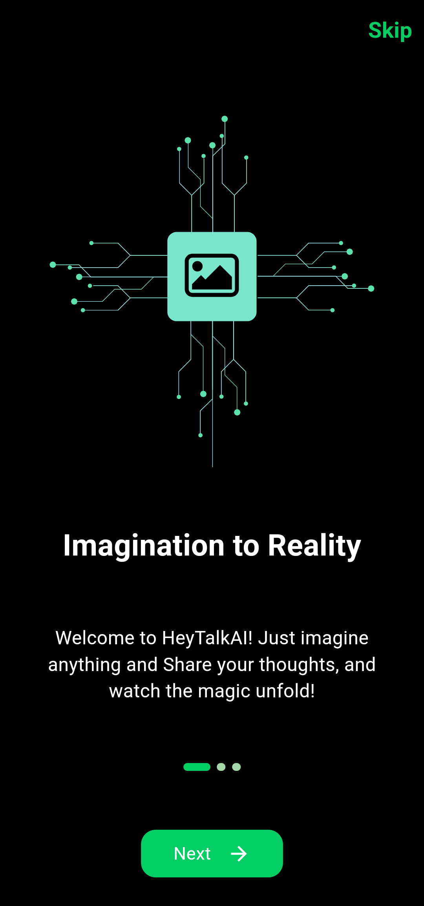
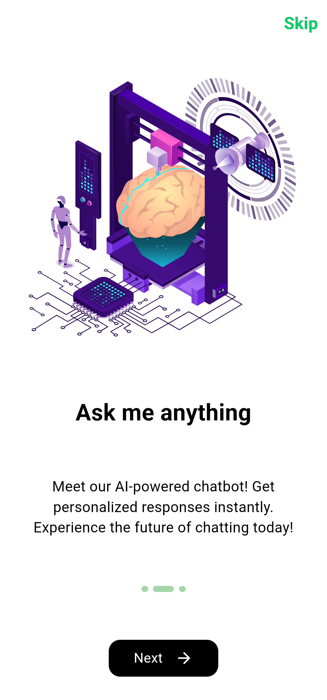
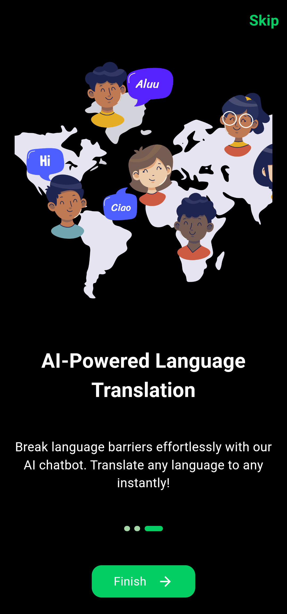
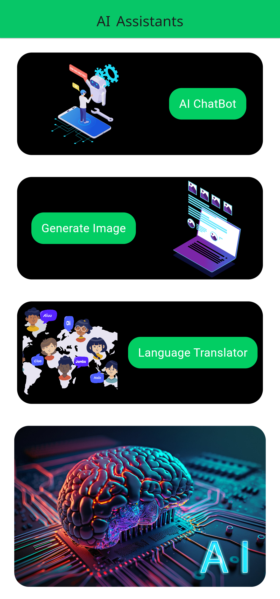
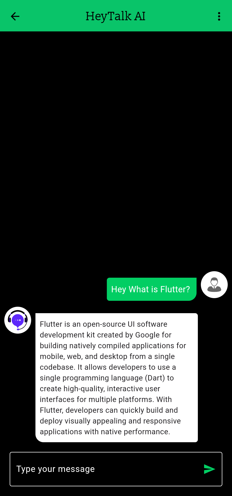
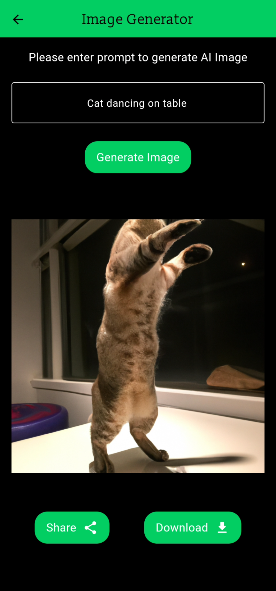
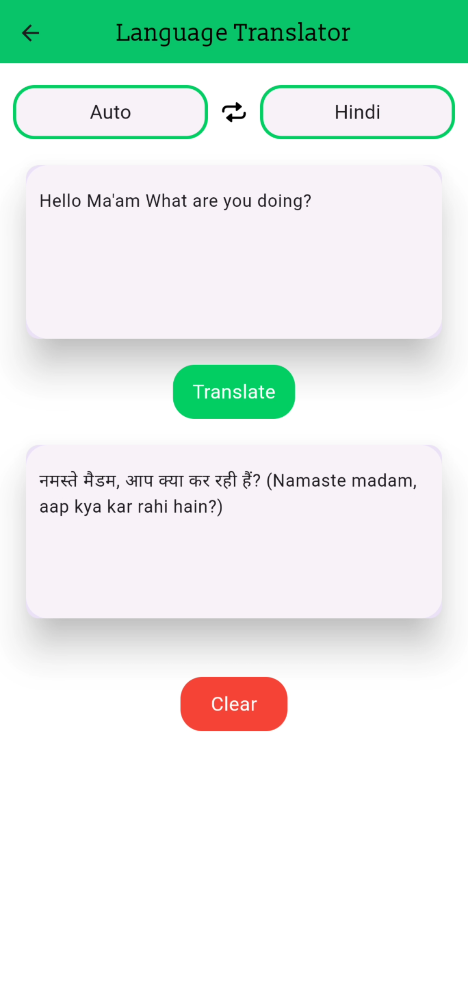

<!-- Project Title -->
<div align="center" style="display: flex; align-items: center; justify-content: center;">
  
</div>

<h1 align="center">AI Application with OpenAI Integration</h1>


## 🔰 Project Overview
This project involves the design and implementation of a cross-platform AI application leveraging OpenAI's powerful suite of tools. The application focuses on enhancing user interactions through intelligent chatbots, user-driven image generation, and language translation modules.

---
### 🎥 Simple demo
<p align="center">
  
</p>

---
## ➤ Key Features

### 1. Intelligent Chatbots

- Developed intelligent chatbots capable of resolving user queries and generating informative responses.
- These chatbots are trained to adapt to various response models, enhancing their versatility and effectiveness in different scenarios.

### 2. User-Driven Image Generation with DALL.E

- Leveraging OpenAI's state-of-the-art DALL.E model, our application empowers users to drive image generation based on their creative prompts.
- By providing intuitive prompts, users can effortlessly generate visually captivating images, expanding the boundaries of creativity within our platform.

### 3. Language Translation Module

- Developed a language translation module to facilitate seamless communication across linguistic barriers.
- Users can input text in their preferred language, and the system translates it into the desired target language in real-time.
- This module enhances the accessibility and usability of the application for users worldwide.

### 4. Cross-Platform Compatibility

- The application is designed to run seamlessly across different platforms, ensuring accessibility for a wide range of users.


---
## 🛠 Technologies and Frameworks Used
-  Figma (for UI design)
-  Flutter Framework (Dart language)
-  OpenAI (Used API for image generation and intelligent chats)
-  Provider (for state management)


## ⚡Usage/Examples

```javascript
import 'package:flutter/material.dart';
void main() async {
  WidgetsFlutterBinding.ensureInitialized();
  await Firebase.initializeApp();
  runApp(MyApp());
}

//MyApp
class MyApp extends StatefulWidget {
  @override
  _MyAppState createState() => _MyAppState();
}

// Send prompt to API and get the response
static Future<List<ChatModel>> sendMessageToAPI(
      {required String message, required String modelName}) async {
    try {
      var response = await http.post(
          Uri.parse("https://api.openai.com/v1/chat/completions"),
          headers: {
            'Authorization': 'Bearer $OPENAI_API_KEY',
            'Content-Type': 'application/json'
          },
          body: jsonEncode({
            "model": modelName,
            "messages": [
              {"role": "user", "content": message}
            ]
          }));
      Map jsonResponse = jsonDecode(response.body);
.............
}
```

## 🚀 Installation

1. **Clone the repository:**

   ```bash
   git clone https://github.com/sahilpotdukhe/HeyTalkAI.git
2. **Navigate to the project directory:**
    ```bash
    cd echat
3. **Install dependencies:**
    ```bash
    flutter pub get
4. **Run the app:**
    ```bash
    flutter run

## 📋 Requirements

- Flutter SDK: [Installation Guide](https://flutter.dev/docs/get-started/install)
- OpenAI API: [Usage](https://platform.openai.com/overview)
- Figma Account: [Sign up for Figma](https://www.figma.com/)


##  App Design

<div align="center">
  <table style="border-collapse: collapse;">
    <tr>
      <td style="padding-right: 0px; border: none;">
        
        <p align="center">OnBoarding Screen 1</p>
      </td>
      <td style="padding-right: 0px; border: none;">
        
        <p align="center">OnBoarding Screen 2</p>
      </td>
      <td style="border: none;">
        
        <p align="center">OnBoarding Screen 3</p>
      </td>
    </tr>
  </table>
</div>
<div align="center">
  <table style="border-collapse: collapse;">
    <tr>
      <td style="padding-right: 0px; border: none;">
        
        <p align="center">Home Screen</p>
      </td>
      <td style="padding-right: 0px; border: none;">
        
        <p align="center">ChatBot</p>
      </td>
      <td style="border: none;">
        
        <p align="center">Image generator</p>
      </td>
    </tr>
  </table>
</div>
<div align="center">
  <table style="border-collapse: collapse;">
    <tr>
      <td style="padding-right: 0px; border: none;">
        
        <p align="center">Language Translator</p>
      </td>
      <td style="border: none;">
        
        <p align="center">Splash Screen</p>
      </td>
    </tr>
  </table>
</div>


## 🤝 Contributing
Contributions are always welcome!
If you have a suggestion that would make this better, please fork the repo and create a pull request. Don't forget to give the project a star! Thanks again!
- Fork the Project
- Create your Feature Branch (```bash git checkout -b feature/AmazingFeature```)
- Commit your Changes (```bash git commit -m 'Add some AmazingFeature'```)
- Push to the Branch (```bash git push origin feature/AmazingFeature```)
- Open a Pull Request 


---
## ➤ Contact
You can reach out to me via the following methods:

- **Email:**  &nbsp;&nbsp;<a href="mailto:sahilpotdukhe.ssp@gmail.com">sahilpotdukhe.ssp@gmail.com
- **Social Media:**
   - &nbsp;&nbsp;[LinkedIn](https://www.linkedin.com/in/sahil-potdukhe/)
   - &nbsp;&nbsp;[GitHub](https://github.com/sahilpotdukhe)
   - &nbsp;&nbsp;[Instagram](https://www.instagram.com/sahilpotdukhe11/)
   - &nbsp;&nbsp;[Twitter](https://twitter.com/SahilPotdukhe)
  ---


